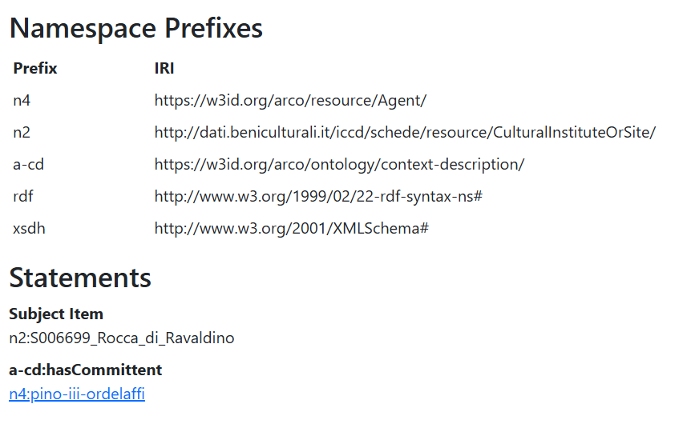

  <a href="index.html">Home</a> |
  <a href="theproject">The Project</a> |
  <a href="methodology.html">Methodology</a> |
  <a href="conclusions.html">Conclusions</a>

# THE PROCESS

This section outlines all the specific steps taken to investigate the **architectural heritage** of [**Romagna**](https://en.wikipedia.org/wiki/Romagna), focusing on the [**Rocca di Ravaldino**](https://it.wikipedia.org/wiki/Rocca_di_Ravaldino) and the [**Rocca di Imola**](https://it.wikipedia.org/wiki/Rocca_sforzesca_di_Imola), historically linked to [**Caterina Sforza**](https://en.wikipedia.org/wiki/Caterina_Sforza).

Click on the highlighted sections below to explore each step of the process in detail.

- [**Identifying the Topic**](#identifying-the-topic)

- [**Depiction of Caterina Sforza**](#depiction-of-caterina-sforza)

- [**Exploring the Fortresses**](#exploring-the-fortresses)

- [**Ordering the Fortresses**](#ordering-the-fortresses)

- [**Checking for Links to Caterina Sforza**](#checking-for-links-to-caterina-sforza)

- [**Checking for other Missing Information**](#checking-for-other-missing-information)

- [**Use of LLMs**](#use-of-llms)

- [**Triples**](#triples)

## Identifying the Topic

The project began by verifying the existence of [Caterina Sforza](https://en.wikipedia.org/wiki/Caterina_Sforza) within the [ArCo](https://dati.beniculturali.it/arco/index.php) knowledge graph. To do this, we executed a **first SPARQL ASK** query to check whether the resource was present:

PREFIX arco: &lt;https://w3id.org/arco/ontology/arco/&gt;
PREFIX rdfs: &lt;http://www.w3.org/2000/01/rdf-schema#&gt;

ASK
WHERE {
  ?person rdfs:label "Caterina Sforza".
}

<mark>The result was TRUE</mark>, confirming the presence of the individual in the KG.
We then performed a **second SELECT query** to retrieve her unique IRI:

PREFIX arco: &lt;https://w3id.org/arco/ontology/arco/&gt;
PREFIX rdfs: &lt;http://www.w3.org/2000/01/rdf-schema#&gt; 
SELECT ?s
WHERE {
  ?s rdfs:label "Caterina Sforza" .
}

The result consisted in the retrieval of the following **agent entity**: <https://w3id.org/arco/resource/Agent/cf402e9bbd5dd8372a35022c85259530>

## Depiction of Caterina Sforza

Although [Caterina Sforza](https://en.wikipedia.org/wiki/Caterina_Sforza) exists in the [ArCo](https://dati.beniculturali.it/arco/index.php) knowledge graph as an **Agent**, she is not directly associated with any **visual depiction**.
To address this gap, we executed a **SPARQL SELECT query** to search for visual properties that could be linked to her, such as **portraits**:

PREFIX arco: &lt;https://w3id.org/arco/ontology/arco/&gt;
PREFIX a-cd: &lt;https://w3id.org/arco/ontology/context-description/&gt;
PREFIX agent: &lt;https://w3id.org/arco/resource/Agent/&gt;
PREFIX rdfs: &lt;http://www.w3.org/2000/01/rdf-schema#&gt; 
SELECT DISTINCT ?cp
WHERE {
&nbsp;&nbsp;?cp a arco:HistoricOrArtisticProperty ;
&nbsp;&nbsp;&nbsp;&nbsp;&nbsp;&nbsp;rdfs:label ?l .
&nbsp;&nbsp;FILTER(REGEX(?l, "Ritratto di Caterina Sforza", "i"))
}

The query returned the following **cultural properties**: 

- <https://w3id.org/arco/resource/HistoricOrArtisticProperty/0900231485> 

- <https://w3id.org/arco/resource/HistoricOrArtisticProperty/0900644122>

- <https://w3id.org/arco/resource/HistoricOrArtisticProperty/0900281635-21>

- <https://w3id.org/arco/resource/HistoricOrArtisticProperty/0900479412>

Among the four properties, we selected <mark>the third one</mark>, as it was the only one featuring a colour painting.

## Exploring the Fortresses

To identify the types of architectural heritage present in the ArCo Knowledge Graph, we first executed a **SPARQL query** aimed at listing all distinct **types of architectural assets**.

SELECT DISTINCT ?type  
WHERE {  
  ?cp a arco:ArchitecturalOrLandscapeHeritage ;  
      dc:type ?type .  
}

We then refined our search by listing only the resources of this type containing the word **"rocca"** in their label:

PREFIX rdfs: <http://www.w3.org/2000/01/rdf-schema#>

SELECT DISTINCT ?s ?label
WHERE {
  ?s rdfs:label ?label .
  FILTER(REGEX(?label, "rocca", "i"))

This helped us identify two resources relevant to our topic:

**Rocca di Imola** ⤵️ <https://w3id.org/arco/resource/ArchitecturalOrLandscapeHeritage/0800242914>

**Rocca di Ravaldino** ⤵️ <http://dati.beniculturali.it/iccd/schede/resource/CulturalInstituteOrSite/S006699_Rocca_di_Ravaldino>

We selected these as our core case studies, due to their **historical connection** to Caterina Sforza.

## Ordering the Fortresses 

To ensure a more structured presentation of the selected heritage sites, we applied the **ORDER BY clause** to **alphabetically** sort the two fortresses by their label.
This improves the clarity of the results and demonstrates our ability to control not only what we query from the knowledge graph, but also how we present it.

PREFIX rdfs: <http://www.w3.org/2000/01/rdf-schema#>

SELECT ?rocca ?label
WHERE {
  VALUES ?rocca {
    <https://w3id.org/arco/resource/ArchitecturalOrLandscapeHeritage/0800242914>
    <http://dati.beniculturali.it/iccd/schede/resource/CulturalInstituteOrSite/S006699_Rocca_di_Ravaldino>
  }
  ?rocca rdfs:label ?label .
}
ORDER BY ?label

ORDER BY allows us to alphabetically sort the fortresses — useful for future scaling (e.g., if we add more sites), and for implementing clean navigation on the GitHub website.

## Checking for Links to Caterina Sforza

To verify whether [Caterina Sforza](https://en.wikipedia.org/wiki/Caterina_Sforza) was already linked to the two fortresses in the [ArCo](https://dati.beniculturali.it/arco/index.php) Knowledge Graph, we used an **ASK query**.

PREFIX arco: <https://w3id.org/arco/ontology/arco/>

ASK {
  {
    <https://w3id.org/arco/resource/Agent/cf402e9bbd5dd8372a35022c85259530> arco:isConnectedTo <https://w3id.org/arco/resource/ArchitecturalOrLandscapeHeritage/0800242914>
  }
  UNION
  {
    <https://w3id.org/arco/resource/Agent/cf402e9bbd5dd8372a35022c85259530> arco:isConnectedTo <http://dati.beniculturali.it/iccd/schede/resource/CulturalInstituteOrSite/S006699_Rocca_di_Ravaldino>
  }
}

<mark>The result was false</mark>. This result justifies the **creation of new RDF triples**, using both **LLM-generated content** and **SPARQL CONSTRUCT** to enrich the knowledge graph with new semantic relations.

## Checking for other Missing Information

We ran a series of **SPARQL ASK queries** to verify whether the two fortresses were already associated with certain semantic properties in the [ArCo](https://dati.beniculturali.it/arco/index.php) Knowledge Graph.
This helped us detect gaps in the data and justify the use of LLMs and new RDF triples to enrich the graph.

- **TEMPORAL DATING**

PREFIX arco: <https://w3id.org/arco/ontology/arco/>

ASK {
  {
    <https://w3id.org/arco/resource/ArchitecturalOrLandscapeHeritage/0800242914>
    arco:hasDating ?date .
  }
  UNION
  {
    <http://dati.beniculturali.it/iccd/schede/resource/CulturalInstituteOrSite/S006699_Rocca_di_Ravaldino>
    arco:hasDating ?date .
  }
}

- **COMMITTENT**

PREFIX a-cd: <https://w3id.org/arco/ontology/context-description/>

ASK {
  {
    <https://w3id.org/arco/resource/ArchitecturalOrLandscapeHeritage/0800242914> 
    a-cd:hasCommittent ?committent .
  }
  UNION
  {
    <http://dati.beniculturali.it/iccd/schede/resource/CulturalInstituteOrSite/S006699_Rocca_di_Ravaldino> 
    a-cd:hasCommittent ?committent .
  }

- **CULTURAL EVENTS**

PREFIX arco: <https://w3id.org/arco/ontology/arco/>

ASK {
  {
    <https://w3id.org/arco/resource/ArchitecturalOrLandscapeHeritage/0800242914> 
    arco:hasCulturalEvent|arco:hasSituationInTime ?event .
  }
  UNION
  {
    <http://dati.beniculturali.it/iccd/schede/resource/CulturalInstituteOrSite/S006699_Rocca_di_Ravaldino> 
    arco:hasCulturalEvent|arco:hasSituationInTime ?event .
  }
}

As already stated before, <mark>all the results were false</mark>.

***

## Use of LLMs

### Dating

As concerns the dating, we submitted the following **zero-shot prompts** to both [Gemini](https://gemini.google.com/?hl=en) and [ChatGPT](https://openai.com/index/chatgpt/), the two LLMs selected for our project. 

> When was the Fortress of Ravaldino built?

> When was the Fortress of Imola built?

With the aim of obtaining the most accurate and reliable information possible, we cross-checked the **construction dates** of the two fortresses using the following **online sources**:

**Rocca di Ravaldino** ➡️ [Official website of Turismo Forlivese](https://turismoforlivese.it/it/arte-cultura/rocca-di-ravaldino/)

**Rocca di Imola** ➡️ [Official website of Imola Musei](https://imolamusei.it/rocca-sforzesca/)

The following screenshots show Gemini's and ChatGPT's anwers regarding the **dating**: 

After consulting these sources, we found that <mark>Gemini was accurate</mark> regarding the **Fortress of Ravaldino**, whereas <mark>ChatGPT provided incorrect information</mark>.

In the case of the **Fortress of Imola**, <mark>Gemini was again correct</mark>, while ChatGPT, although not entirely inaccurate, offered a <mark>less precise response</mark>.

### Committent

As concerns the commissioner, we opted for **a combination of <mark>few-shot and chain-of-thought</mark> prompting** techniques.

We provided the language model with **two structured examples** that not only presented a **possible commissioner**, but also demonstrated a logical, **step-by-step reasoning process** based on historical and political context. This hybrid strategy was chosen to encourage the model to both recognize the expected format (through few-shot examples) and engage in contextual reasoning (via chain-of-thought prompting).

**Fortress of Imola**: 

> Below are two examples of how to reason step by step when identifying the commissioner of a historical fortress.
>
> Example 1:
> Q: Who commissioned the Rocca di Forlimpopoli?
> A:
> 1. The Rocca di Forlimpopoli was built in the mid-14th century.
> 2. During that time, the city was controlled by the Ordelaffi family.
> 3. The Ordelaffi were known for fortifying their domains to protect against rival families.
> 4. Therefore, it is likely that the fortress was commissioned by the ruling Ordelaffi family, probably under Sinibaldo Ordelaffi.
> 
> Example 2:
> Q: Who commissioned the Castello Estense in Ferrara?
> A:
> 1. The Castello Estense was constructed starting in 1385.
> 2. That year, a popular revolt broke out in Ferrara, threatening the Este family.
> 3. Niccolò II d'Este decided to build the fortress as a defensive structure adjacent to the city palace.
> 4. Thus, Niccolò II d'Este was the commissioner of the castle.
> 
> Now answer this question using the same format:
> Q: Who commissioned the Rocca di Imola?

Gemini's answer: 

ChatGPT's answer: 

However, according to the [official website of Imola Musei](https://imolamusei.it/rocca-sforzesca/), <mark>both answers were wrong</mark>. We got the right answer through a new **zero-shot prompt**, which provided us a <mark>true answer</mark>. 

**Fortress of Ravaldino**: 

> I will give you some examples of Italian castles or fortresses along with their historical patron, followed by a brief explanation of the historical context in which they were built or renovated.
> 
> Example 1:  
> Work: Castello Sforzesco  
> Patron: Francesco Sforza  
> Context: After becoming Duke of Milan, Francesco Sforza began the reconstruction of the castle in 1450 as a symbol of his power. It was a time of political instability, and castles served both defensive and symbolic purposes.
> 
> Example 2:  
> Work: Fortezza Medicea di Arezzo  
> Patron: Cosimo I de’ Medici  
> Context: Built to reinforce Medici control over the city and symbolize Grand Ducal dominance during the 16th century. The project started as part of a wider effort to consolidate power.
> 
> Now, please analyze the following case using the same format.
> 
> Work: Rocca di Ravaldino (Forlì)  
> Patron:  
> Context:

Gemini's answer: 

ChatGPT's answer: 

After cross-checking both answers with the [official website of Turismo Forlivese](https://turismoforlivese.it/it/arte-cultura/rocca-di-ravaldino/), we noticed that <mark>GhatGPT's answer was wrong</mark>, whereas <mark>Gemini's answer was true</mark>. 

### Cultural Events

To enrich the information related to the two fortresses, we searched for **relevant cultural events** within the [ArCo](https://dati.beniculturali.it/arco/index.php) ontology.
We started by exploring the class arco:EventOrSituationInTime to retrieve existing cultural events in the [ArCo](https://dati.beniculturali.it/arco/index.php) Knowledge Graph.

We used the following **SPARQL query** to retrieve a sample of available events:

PREFIX arco: <https://w3id.org/arco/ontology/core/>
PREFIX rdf: <http://www.w3.org/1999/02/22-rdf-syntax-ns#>
PREFIX rdfs: <http://www.w3.org/2000/01/rdf-schema#>

SELECT ?event ?label ?description
WHERE {
  ?event rdf:type arco:EventOrSituationInTime .
  OPTIONAL { ?event rdfs:label ?label . }
  OPTIONAL { ?event arco:description ?description . }
}
LIMIT 10

These were the results:

We selected **three** of them that were **relevant and plausible** to associate with the [Rocca di Imola](https://it.wikipedia.org/wiki/Rocca_sforzesca_di_Imola) and the [Rocca di Ravaldino](https://it.wikipedia.org/wiki/Rocca_di_Ravaldino): 

- **Cena medievale**

- **Visita del castello**

- **Corteo**

After retrieving these events, we formulated a **zero-shot prompt** and submitted it to both [Gemini](https://gemini.google.com/?hl=it) and [ChatGPT](https://openai.com/index/chatgpt/), asking whether such activities could realistically take place at the [Rocca di Imola](https://it.wikipedia.org/wiki/Rocca_sforzesca_di_Imola) and the [Rocca di Ravaldino](https://it.wikipedia.org/wiki/Rocca_di_Ravaldino).

Rocca di Ravaldino:

> Among these cultural events: "Medieval Dinner, Visit to the Castle and Historical Procession", which one is possible to do in Ravaldino Fortress?

Rocca di Imola: 

> Among these cultural events: "Medieval Dinner, Visit to the Castle and Historical Procession", which one is possible to do in Imola Fortress?

Both language models agreed that <mark>only one of the three events</mark>, the **visit to the castle**, was appropriate and realistic for both fortresses.

### Relationship with Caterina Sforza

We decided then to ask Gemini and ChatGPT if there is indeed a **historical connection** between [Caterina Sforza](https://en.wikipedia.org/wiki/Caterina_Sforza) and the two fortresses using a **few-shot prompt**.

> We are working on a project to enrich a cultural heritage knowledge graph using RDF triples. We need to verify whether there is a historical relationship between a specific person and a monument. Below are a few examples. Can you answer the final question using the same style?
> 
> Example 1
> Q: Is there a historical link between Federico II and the Castello Svevo of Bari?
> A: Yes. The Castello Svevo of Bari was rebuilt by Emperor Frederick II in 1233. He turned it into a fortified castle, and it served as an important part of his defensive system in southern Italy.
> 
> Example 2
> Q: Did Leonardo da Vinci have a connection to the Castello Sforzesco in Milan?
> A: Yes. Leonardo da Vinci worked at the court of Ludovico il Moro and contributed to the design and decoration of the Castello Sforzesco, including engineering works and artistic commissions.
> 
> Q: Is there a historical relationship between Caterina Sforza and the Rocca di Imola or the Rocca di Ravaldino?

ChatGPT's answer: 

Gemini's answer: 

Both large language models <mark>confirmed the historical connection</mark> between [Caterina Sforza](https://en.wikipedia.org/wiki/Caterina_Sforza) and the two fortresses.

***

## Triples

### First Triple

**Depiction of Caterina Sforza**

After all the work retrieved from the step [Depiction of Caterina](#depiction-of-caterina-sforza), an **image** was identified and associated with Caterina using a **CONSTRUCT query**, which allows the creation of new RDF triples to enrich the graph.

The **zero-shot prompt** given to create the SPARQL CONSTRUCT query was the following: 

> We are working on a cultural heritage knowledge graph using SPARQL. 
>
> Generate a SPARQL CONSTRUCT query and a corresponding RDF triple in Turtle syntax that links the following agent to a depiction using the foaf:depiction predicate.
> The agent is identified by the IRI: 
> https://w3id.org/arco/resource/Agent/cf402e9bbd5dd8372a35022c85259530.
> The depiction is an image located at the IRI: 
> https://www.sigecweb.beniculturali.it/images/fullsize/ICCD50007125/ICCD5194406_16411.jpg.
>
> Use standard RDF prefixes (e.g., foaf, rdf, rdfs). First, provide the CONSTRUCT query, then the RDF triple in Turtle syntax.

We obtained the following CONSTRUCT query: 

CONSTRUCT {
  <https://w3id.org/arco/resource/Agent/cf402e9bbd5dd8372a35022c85259530> foaf:depiction <https://www.sigecweb.beniculturali.it/images/fullsize/ICCD50007125/ICCD5194406_16411.jpg> .
}
WHERE {
  # No specific WHERE clause is needed if we are just asserting a new fact.
  # This CONSTRUCT query will always produce the triple.
}

Triple obtained: 

<table style="table-layout: fixed; width: 100%; word-wrap: break-word;">
  <thead>
    <tr>
      <th>Subject</th>
      <th>Predicate</th>
      <th>Object</th>
    </tr>
  </thead>
  <tbody>
    <tr>
      <td>Caterina Sforza</td>
      <td>foaf:depiction</td>
      <td>Ritratto di Caterina Sforza</td>
    </tr>
    <tr>
      <td><code>&lt;https://w3id.org/arco/resource/Agent/cf402e9bbd5dd8372a35022c85259530&gt;</code></td>
      <td><code>&lt;http://xmlns.com/foaf/0.1/&gt;</code></td>
      <td><code>&lt;https://www.sigecweb.beniculturali.it/images/fullsize/ICCD50007125/ICCD5194406_16411.jpg&gt;</code></td>
    </tr>
  </tbody>
</table>

### Second Triple

**Dating - Rocca di Imola**

After retrieving the information from the [Designation in Time](#designation-in-time) step, we asked large language models to generate a SPARQL CONSTRUCT query that would link the **Fortress of Imola** to its **date of construction**, identified as **1261**.

The **zero-shot prompt** used to create the query was the following:

> We are working on a cultural heritage knowledge graph using SPARQL.
> 
> The Rocca di Imola was built in 1261. Please write a SPARQL CONSTRUCT query that creates an RDF triple with: 
> Subject: <https://w3id.org/arco/resource/ArchitecturalOrLandscapeHeritage/0800242914> 
> Predicate: arco:hasDating 
> Object: "1261"^^xsd:gYear
> 
> First, provide the CONSTRUCT query, then the RDF triple in Turtle syntax. Include all necessary PREFIX declarations.

We obtained the following COSTRUCT query: 

PREFIX arco: <https://w3id.org/arco/ontology/arco/>

CONSTRUCT {
  <https://w3id.org/arco/resource/ArchitecturalOrLandscapeHeritage/0800242914> arco:hasDating "1261" .
}
WHERE {
}

Triple obtained: 

<table style="table-layout: fixed; width: 100%; word-wrap: break-word;">
  <thead>
    <tr>
      <th>Subject</th>
      <th>Predicate</th>
      <th>Object</th>
    </tr>
  </thead>
  <tbody>
    <tr>
      <td>Rocca di Imola</td>
      <td>hasDating</td>
      <td>1261</td>
    </tr>
    <tr>
      <td><code>&lt;https://w3id.org/arco/resource/ArchitecturalOrLandscapeHeritage/0800242914&gt;</code></td>
      <td><code>&lt;https://w3id.org/arco/ontology/context-description/hasDating&gt;</code></td>
      <td><code>&lt;1261&gt;</code></td>
    </tr>
  </tbody>
</table>

### Third Triple

**Dating - Rocca di Ravaldino**

The same approach was applied to the **Fortress of Ravaldino** and its **construction date**, that is **1471**. 

The **zero-shot** prompt used to create the query was the following:

> We are working on a cultural heritage knowledge graph using SPARQL.
>
> The Rocca di Ravaldino was built in 1471. Please write a SPARQL CONSTRUCT query that creates an RDF triple with:
> Subject: http://dati.beniculturali.it/iccd/schede/resource/CulturalInstituteOrSite/S006699_Rocca_di_Ravaldino 
> Predicate: arco:hasDating
> Object: "1471"
>
> Include all necessary PREFIX declarations.

We obtained the following CONSTRUCT query: 

PREFIX arco: <https://w3id.org/arco/ontology/arco/>

CONSTRUCT {
  <http://dati.beniculturali.it/iccd/schede/resource/CulturalInstituteOrSite/S006699_Rocca_di_Ravaldino> arco:hasDating "1471" .
}
WHERE {
}

Triple obtained: 

<table style="table-layout: fixed; width: 100%; word-wrap: break-word;">
  <thead>
    <tr>
      <th>Subject</th>
      <th>Predicate</th>
      <th>Object</th>
    </tr>
  </thead>
  <tbody>
    <tr>
      <td>Rocca di Ravaldino</td>
      <td>hasDating</td>
      <td>1471</td>
    </tr>
    <tr>
      <td><code>&lt;http://dati.beniculturali.it/iccd/schede/resource/CulturalInstituteOrSite/S006699_Rocca_di_Ravaldino&gt;</code></td>
      <td><code>&lt;https://w3id.org/arco/ontology/context-description/hasDating&gt;</code></td>
      <td><code>&lt;1471&gt;</code></td>
    </tr>
  </tbody>
</table>

### Fourth Triple

**Committent - Rocca di Imola**

After retrieving the information from the [Committent](#committent) step, we asked large language models to generate a SPARQL CONSTRUCT query that would link the **Fortress of Imola** to its **commissioner**, identified as [**Comune di Imola**](https://www.comune.imola.bo.it/).

The **chain-of-thought prompt** used to create the query was the following:

> Let’s think step by step.
>
> We are working with RDF triples using the ArCo ontology.
> We want to indicate that the Rocca di Imola was commissioned by the Comune di Imola.
> The subject is the Rocca di Imola, whose IRI is: <https://w3id.org/arco/resource/ArchitecturalOrLandscapeHeritage/0800242914>
> The predicate is the ArCo property used to express who commissioned a cultural heritage site:a-cd:hasCommittent
> The object is the Comune di Imola, which exists in ArCo with the following IRI: <https://w3id.org/arco/resource/Agent/d801d3392b7a87fb2af08dfda818d475>
> 
> Now:
> First, write a SPARQL CONSTRUCT query to generate this triple.
> Then, write the resulting triple in Turtle syntax.
> Include all necessary prefixes.

We obtained the following CONSTRUCT query:

PREFIX a-cd: <https://w3id.org/arco/ontology/context-description/>
PREFIX arco: <https://w3id.org/arco/resource/>

CONSTRUCT {
  <https://w3id.org/arco/resource/ArchitecturalOrLandscapeHeritage/0800242914>
    a-cd:hasCommittent
    <https://w3id.org/arco/resource/Agent/d801d3392b7a87fb2af08dfda818d475> .
}
WHERE {
}

Triple obtained: 

<table style="table-layout: fixed; width: 100%; word-wrap: break-word;">
  <thead>
    <tr>
      <th>Subject</th>
      <th>Predicate</th>
      <th>Object</th>
    </tr>
  </thead>
  <tbody>
    <tr>
      <td>Rocca di Imola</td>
      <td>hasCommittent</td>
      <td>Comune di Imola</td>
    </tr>
    <tr>
      <td><code>&lt;https://w3id.org/arco/resource/ArchitecturalOrLandscapeHeritage/0800242914&gt;</code></td>
      <td><code>&lt;https://w3id.org/arco/ontology/context-description/hasCommittent&gt;</code></td>
      <td><code>&lt;https://w3id.org/arco/resource/Agent/d801d3392b7a87fb2af08dfda818d475&gt;</code></td>
    </tr>
  </tbody>
</table>

### Fifth Triple

**Committent - Rocca di Ravaldino**

The same process was applied to the Fortress of Ravaldino and its **commissioner**, **Pino III Ordelaffi**.
Since [Pino III Ordelaffi](https://it.wikipedia.org/wiki/Pino_III_Ordelaffi) is not present in [ArCo](https://dati.beniculturali.it/arco/index.php), we instructed the LLMs to take his absence into account, and we minted a new IRI to represent him.

The **chain-of-thought prompt** used to create the query was the following:

> Let’s think step by step.
>
> We are working with RDF triples using ArCo ontology.
> The subject is the Rocca di Ravaldino in Forlì. This is the resource: http://dati.beniculturali.it/iccd/schede/resource/CulturalInstituteOrSite/S006699_Rocca_di_Ravaldino>
> The predicate is the property used in ArCo to indicate the commissioner of a cultural heritage site:a-cd:hasCommittent
> The object is the person who historically commissioned the fortress: Pino III Ordelaffi. Since he is not present in ArCo, we mint a new IRI: <https://w3id.org/arco/resource/Agent/pino-iii-ordelaffi>
>
> Now write a SPARQL CONSTRUCT query that creates this triple. Use the correct syntax and include any necessary prefix.

We obtained the following CONSTRUCT query:

PREFIX a-cd: <https://w3id.org/arco/ontology/context-description/>

CONSTRUCT {
  <http://dati.beniculturali.it/iccd/schede/resource/CulturalInstituteOrSite/S006699_Rocca_di_Ravaldino>
    a-cd:hasCommittent <https://w3id.org/arco/resource/Agent/pino-iii-ordelaffi> .
}
WHERE {
}

Triple obtained: 

<table style="table-layout: fixed; width: 100%; word-wrap: break-word;">
  <thead>
    <tr>
      <th>Subject</th>
      <th>Predicate</th>
      <th>Object</th>
    </tr>
  </thead>
  <tbody>
    <tr>
      <td>Rocca di Ravaldino</td>
      <td>hasCommittent</td>
      <td>Pino III Ordelaffi</td>
    </tr>
    <tr>
      <td><code>&lt;http://dati.beniculturali.it/iccd/schede/resource/CulturalInstituteOrSite/S006699_Rocca_di_Ravaldino&gt;</code></td>
      <td><code>&lt;https://w3id.org/arco/ontology/context-description/hasCommittent&gt;</code></td>
      <td><code>&lt;https://w3id.org/arco/resource/Agent/pino-iii-ordelaffi&gt;</code></td>
    </tr>
  </tbody>
</table>

### Sixth Triple

**Cultural Events - Rocca di Imola**

After retrieving the information from the [Cultural Events](#cultural-events) step, we asked large language models to generate a SPARQL CONSTRUCT query that would link the **Fortress of Imola** to its **cultural event**: **visit to the castle**.

The **zero-shot prompt** used to create the query was the following:

> We are working with the ArCo and CIS ontologies and need to represent that a cultural property is involved in a cultural event. 
>
> Please generate: 
> a SPARQL CONSTRUCT query 
> and the corresponding RDF triple in Turtle syntax 
> Subject: <https://w3id.org/arco/resource/ArchitecturalOrLandscapeHeritage/0800242914> 
> Predicate: cis:isInvolvedInCulturalEvent 
> Object: <https://w3id.org/arco/resource/Event/eve-s56-rsef18b> 
>
> Make sure to use the correct prefixes and return only the CONSTRUCT query and the Turtle triple.

We obtained the following CONSTRUCT query:

PREFIX arco: <https://w3id.org/arco/ontology/arco/>
PREFIX cis: <http://dati.beniculturali.it/cis/>

CONSTRUCT {
  <https://w3id.org/arco/resource/ArchitecturalOrLandscapeHeritage/0800242914> cis:isInvolvedInCulturalEvent <https://w3id.org/arco/resource/Event/eve-s56-rsef18b> .
}
WHERE {
}

Triple obtained: 

<table style="table-layout: fixed; width: 100%; word-wrap: break-word;">
  <thead>
    <tr>
      <th>Subject</th>
      <th>Predicate</th>
      <th>Object</th>
    </tr>
  </thead>
  <tbody>
    <tr>
      <td>Rocca di Imola</td>
      <td>isInvolvedInCulturalEvent</td>
      <td>Visita del Castello</td>
    </tr>
    <tr>
      <td><code>&lt;https://w3id.org/arco/resource/ArchitecturalOrLandscapeHeritage/0800242119&gt;</code></td>
      <td><code>&lt;http://dati.beniculturali.it/cis/isInvolvedInCulturalEvent&gt;</code></td>
      <td><code>&lt;https://w3id.org/arco/resource/Event/eve-s56-rsef18b&gt;</code></td>
    </tr>
  </tbody>
</table>

### Seventh Triple

**Cultural Events - Rocca di Ravaldino**

The same process was applied to the **Fortress of Ravaldino** and its **cultural event**, the **visit to the castle**. 

The **zero-shot prompt** used to create the query was the following:

> We are working with the ArCo and CIS ontologies and need to represent that a cultural property is involved in a cultural event. 
>
> Please generate: 
> a SPARQL CONSTRUCT query 
> and the corresponding RDF triple in Turtle syntax 
> Subject: <http://dati.beniculturali.it/iccd/schede/resource/CulturalInstituteOrSite/S006699_Rocca_di_Ravaldino> 
> Predicate: cis:isInvolvedInCulturalEvent 
> Object: <https://w3id.org/arco/resource/Event/eve-s56-rsef18b> 
>
> Make sure to use the correct prefixes and return only the CONSTRUCT query and the Turtle triple.

We obtained the following CONSTRUCT query:

PREFIX arco: <https://w3id.org/arco/ontology/arco/> 
PREFIX cis: <http://dati.beniculturali.it/cis/> 
CONSTRUCT { <http://dati.beniculturali.it/iccd/schede/resource/CulturalInstituteOrSite/S006699_Rocca_di_Ravaldino> cis:isInvolvedInCulturalEvent <https://w3id.org/arco/resource/Event/eve-s56-rsef18b> . 
} 
WHERE { 
}

Triple obtained: 

<table style="table-layout: fixed; width: 100%; word-wrap: break-word;">
  <thead>
    <tr>
      <th>Subject</th>
      <th>Predicate</th>
      <th>Object</th>
    </tr>
  </thead>
  <tbody>
    <tr>
      <td>Rocca di Ravaldino</td>
      <td>isInvolvedInCulturalEvent</td>
      <td>Visita del Castello</td>
    </tr>
    <tr>
      <td><code>&lt;http://dati.beniculturali.it/iccd/schede/resource/CulturalInstituteOrSite/S006699_Rocca_di_Ravaldino&gt;</code></td>
      <td><code>&lt;http://dati.beniculturali.it/cis/isInvolvedInCulturalEvent&gt;</code></td>
      <td><code>&lt;https://w3id.org/arco/resource/Event/eve-s56-rsef18b&gt;</code></td>
    </tr>
  </tbody>
</table>

### Eighth Triple

**Connection to Caterina Sforza - Rocca di Imola**

After retrieving the information from the [Connection to Caterina Sforza](#connection-to-caterina-sforza) step, we asked large language models to generate a SPARQL CONSTRUCT query that would link the **Fortress of Imola** to **Caterina Sforza**.

The **zero-shot prompt** used to create the query was the following:

> We are working on a cultural heritage knowledge graph using SPARQL.
>
> We want to connect the Rocca di Imola to Caterina Sforza. Please write a SPARQL CONSTRUCT query and create an RDF triple using Turtle syntax with:
> Subject: <https://w3id.org/arco/resource/ArchitecturalOrLandscapeHeritage/0800242914>
> Predicate: arco:hasRelatedAgent 
> Object: https://w3id.org/arco/resource/Agent/cf402e9bbd5dd8372a35022c85259530
>
> Include all necessary PREFIX declarations.

We obtained the following CONSTRUCT query: 

PREFIX cd: <https://w3id.org/arco/ontology/context-description/>

CONSTRUCT {
  <https://w3id.org/arco/resource/ArchitecturalOrLandscapeHeritage/0800242914>
    cd:hasRelatedAgent
    <https://w3id.org/arco/resource/Agent/cf402e9bbd5dd8372a35022c85259530> .
}
WHERE {
  <https://w3id.org/arco/resource/Agent/cf402e9bbd5dd8372a35022c85259530> ?p ?o .
}

Triple obtained: 

<table style="table-layout: fixed; width: 100%; word-wrap: break-word;">
  <thead>
    <tr>
      <th>Subject</th>
      <th>Predicate</th>
      <th>Object</th>
    </tr>
  </thead>
  <tbody>
    <tr>
      <td>Rocca di Imola</td>
      <td>hasRelatedAgent</td>
      <td>Caterina Sforza</td>
    </tr>
    <tr>
      <td><code>&lt;https://w3id.org/arco/resource/ArchitecturalOrLandscapeHeritage/0800242119&gt;</code></td>
      <td><code>&lt;https://w3id.org/arco/ontology/context-description/hasRelatedAgent&gt;</code></td>
      <td><code>&lt;https://w3id.org/arco/resource/Agent/cf402e9bbd5dd8372a35022c85259530&gt;</code></td>
    </tr>
  </tbody>
</table>

### Ninth Triple

**Connection to Caterina Sforza - Rocca di Ravaldino**

The same steps were applied to the **Fortress of Ravaldino**. 

The **zero-shot prompt** used to create the query was the following:

> We are working on a cultural heritage knowledge graph using SPARQL.
>
> We want to connect the Rocca di Ravaldino to Caterina Sforza. Please write a SPARQL CONSTRUCT query and create an RDF triple using Turtle syntax with:
> Subject: http://dati.beniculturali.it/iccd/schede/resource/CulturalInstituteOrSite/S006699_Rocca_di_Ravaldino
> Predicate: arco:hasRelatedAgent 
> Object: https://w3id.org/arco/resource/Agent/cf402e9bbd5dd8372a35022c85259530
>
> Include all necessary PREFIX declarations.

We obtained the following CONSTRUCT query: 

PREFIX arco: <https://w3id.org/arco/ontology/core/>

CONSTRUCT {
  <http://dati.beniculturali.it/iccd/schede/resource/CulturalInstituteOrSite/S006699_Rocca_di_Ravaldino>
    arco:hasRelatedAgent <https://w3id.org/arco/resource/Agent/cf402e9bbd5dd8372a35022c85259530> .
}
WHERE {
}

Triple obtained: 

<table style="table-layout: fixed; width: 100%; word-wrap: break-word;">
  <thead>
    <tr>
      <th>Subject</th>
      <th>Predicate</th>
      <th>Object</th>
    </tr>
  </thead>
  <tbody>
    <tr>
      <td>Rocca di Ravaldino</td>
      <td>hasRelatedAgent</td>
      <td>Caterina Sforza</td>
    </tr>
    <tr>
      <td><code>&lt;http://dati.beniculturali.it/iccd/schede/resource/CulturalInstituteOrSite/S006699_Rocca_di_Ravaldino&gt;</code></td>
      <td><code>&lt;https://w3id.org/arco/ontology/context-description/hasRelatedAgent&gt;</code></td>
      <td><code>&lt;https://w3id.org/arco/resource/Agent/cf402e9bbd5dd8372a35022c85259530&gt;</code></td>
    </tr>
  </tbody>
</table>
